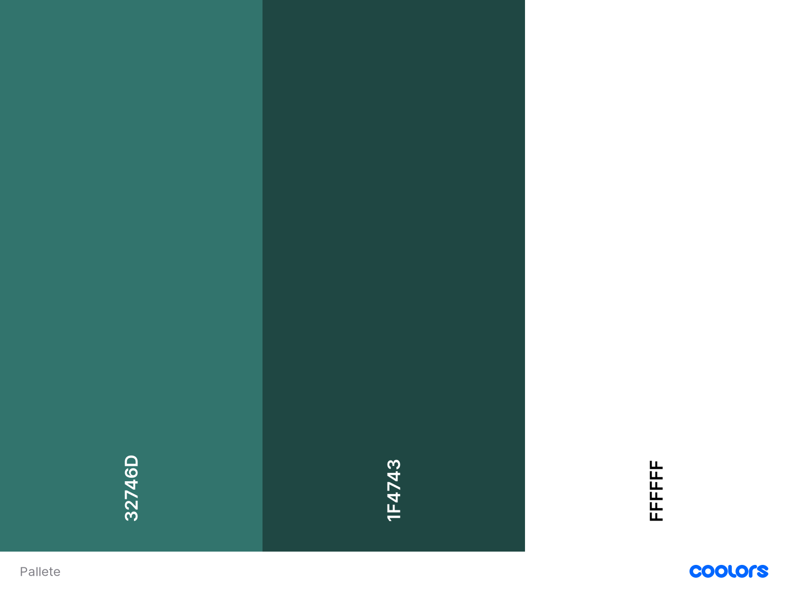
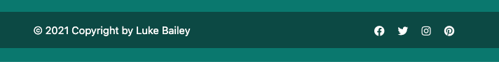
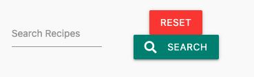
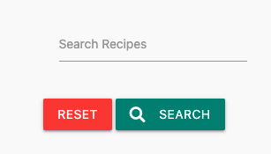

# Foodie-tastic!

[View the live project here.](https://flask-recipe-cookbook.herokuapp.com/)

This project was created as part of my Milestone Project 3 with Code Institute Web Application Development course. 

For the project and to demonstrate what I have learned in the course, have decided to create an online recipe cookbook application called ‘Foodie-tastic!’. The inspiration was provided by Code Institute in the project assessment handbook.

The main goal of the site is to be a recipe-sharing site. Allowing users to create and share their own recipes with the community. 


## User Stories

First Time Visitor Goals

* As a first-time user, want to understand what the website is about 
* As a first-time user can clearly see how it works
* As a first-time user, want to see the recipes on offer
* As a first-time user, want to visit the web application social media pages
* As a first-time user clearly can see where they can register for an account

Returning Visitor Goals

* As a returning user, able to add new recipes to the community
* As a returning user, able to edit their own recipes
* As a returning user, able to delete their own recipes
* As a returning user, able to see recipes created by others in the community
* As a returning user, able to see recipes created/promoted  by the site owner
* As a returning user can identify where and easily log in
* As a returning user, once logged in can easily navigate through the site

Site Owner Goals

* As a site owner, able to add and promote their own recipes
* As a site owner, able to keep website content clean
* As a site owner, able to delete any recipes
* As a site owner, able to edit recipes to fix any mistakes

## Design

**Color Scheme**

The site comprises two different shades of green with white text. 
The navbar and the footer would be a dark shade of green while the body is a light shade of green. 
The recipe cards would have a background color of white and the delete buttons red to identify as a danger.



**Typograpghy**

The main font I have used is the ‘Poppins’ for its clean and minimal look with the backup font as sans-serif font if there were any problems using the first choice. 

**Imagery**

The hero image was sourced from Unsplash and was chosen because I felt it captures the gathering of a community coming together to share foods as the aim of the site is for the community to share their recipes.

**Database Structure**

The database is not a relational database and was created using MongoDB. 
There are only two databases in the collection, named:

* Users
* Recipes

**Wireframes**

## Features

There are a number of features that have been implemented into the website which are:

* Navbar to allow users to navigate through the site
* Footer to store social media links 
* Social media links to connect users to the site social media
* Responsive on all devices
* Register to create an account
* View recipes created by the community show as cards
* Users can add their own recipes to the collection
* User can edit their own recipes 
* User can delete their own recipes
* Admin account created for the site owner
* Admin can add, edit or delete any recipes in the collection to keep things clean
* Search bar 
* Recipes card showing the full detail of a particular recipe

**Future Implementations**

There were a few more ideas that I had for the site that could be implemented in the future.

* Profile page account, showing their own collection of their own recipes
* Live count of their own recipes on the profile page.
* Live count of recipes in the community collection on the home page
* Accept images files as an alternative to URL links
* User can delete their own account


## Technology Used

**Language Used**

* HTML5
* CSS3
* JavaScript
* Python

**Frameworks, Libraries, and Programs Used**

* [Google Font](https://fonts.google.com/)
    * The font 'Poppins' was imported from Google Font.
* [Font Awesome](https://fontawesome.com/)
    * Used to get some icons for the site.
* [Gitpod](https://www.gitpod.io/)
    * Gitpod is the development environment used to develop the project.
* [GitHub](https://github.com/)
    * GitHub is used to store the code for the site.
* [Git](https://git-scm.com/)
    * Git was used as version control, to add, commit and push Git and GitHub.
* [Balsamiq](https://balsamiq.com/)
    * Used to create wireframes for the website.
* [Google Developer Chrome Tools](https://developers.google.com/web/tools/chrome-devtools)
    * Used to inspect elements of the page and debug any potential problems within the website.
* [Unsplash](https://unsplash.com/)
    * Used to get stock-free images for the project.
* [Flask](https://flask.palletsprojects.com/en/2.0.x/)
    * Used as an application framework
* [Materialize](https://materializecss.com/)
    * Used to create a responsive site.
* [MongoDB](https://www.mongodb.com/)
    * Used to create and store content as a database.
* [jQuery](https://jquery.com/)
    * Used to work with Materialize framework
* [PyMongo](https://pypi.org/project/pymongo/)
    * Used to work with MongoDB.
* [Flask-PyMongo](https://pypi.org/project/Flask-PyMongo/)
    * Used as a bridge to communicate between Flask and PyMongo.
* [Flask-Paginate](https://pypi.org/project/flask-paginate/)
    * Used to provide pagination functionality.
* [Jinja](https://jinja.palletsprojects.com/)
    * Used as a templating language for Python to display backend data to HTML.
* [Werkzeug](https://werkzeug.palletsprojects.com/en/2.0.x/utils/#module-werkzeug.security)
    * Used to get protection for passwords.
* [Coolors](https://coolors.co/)
    * Used to create a cohesive color scheme for the website.
* [Heroku](https://www.heroku.com/)
    * Used to deploy the website.

 ## Issues

 There is a known issue with the footer that is not completely sticking to the bottom. As shown in the screenshot below:



There is a known issue with the search bar buttons when viewed on mobile. 
There is no spacing between the buttons. As shown in the screenshot below:



This was solved by creating a row for just the buttons. 



As part of developing the site, wanted to create a live counter to display the number of recipes in the database as part of promoting the site on its home page.
It displays incorrectly, therefore have decided to delete the code from the site.
The code is shown below:

In app.py
```
@app.route("/number")
def number():
   result = mongo.db.recipes.find().count()
   return result
```

In home.html page
```
{{ url_for('number') }}
```

It displays as “/number” instead of an actual number of recipes.

As part of developing the site, I wanted to limit what the user can edit or delete a recipe.
The user can only edit or delete their own recipes but not of other recipes created by other users. I wanted to check if the username is in session and if the recipe is created by said username, the user can delete/edit. If they are not logged in or the recipe is not created by the said username, it does not authorize the user to delete. The code is shown below, 

```
@app.route("/delete_recipe/<recipes_id>")
def delete_recipe(recipes_id):
   if "username" in session:
       user = session["username"]
       recipes = mongo.db.recipes.find_one({"_id": ObjectId(recipes_id)})
       if recipes["created_by"] == user:
               mongo.db.recipes.remove({"_id": ObjectId(recipes_id)})
               flash("Recipe Successfully Deleted")
       else:
           flash("Sorry, you are not allowed to do this")
           return redirect(url_for("get_recipe"))
   else:
       flash("Sorry, you must log in")
       return redirect(url_for("login"))
   return redirect(url_for("get_recipe"))
```

The problem was that it bypass it straight to “sorry, you must log in” as it does not check if the username is in session. But thanks to another student named Manni, he provided his own code on a similar feature. So I could compare, the problem was that the `username` needed to be `user` and it solved the issue.

## Testing

[Click here to see the testing documentation](TESTING.md)

## Deployment

**Deployment to Heroku**

1. Set Up A New Heroku App
    * Navigate to Heroku.com, create a new account, or log in if you already have an account.
    * On the dashboard page, click the "Create New App" button.
    * Give the app a name, the name must be unique with hyphens between words.
    * Set the region closest to you, and click "Create App".
2. Create A Requirements.txt file
    A requirements.txt file contains a list of the Python dependencies that our project needs to run successfully. It's how Heroku can detect what language we're using. Here are the steps to create a requirements.txt file:
    
    Create a requirements.txt file by typing in the terminal:
    ```
    pipi3 freeze --local > requirements.txt
    ```

    Add, commit, and push the file:
    ```
    git add -A
    git commit -m "Add requirements.txt" 
    git push
    ```
3. Create A Procfile file
    A procfile is a special kind of file that tells Heroku how to run our project.
    In the terminal, type:
    ```
    echo web: python run.py > Procfile
    ```

    This command tells Heroku that it's going to be a web process, and the command to run our application is "python run.py", which is the name of the python file that we've created.

    Add, commit, and push the file:
    ```
    git add -A
    git commit -m "Add Procfile" 
    git push
    ```
4. Connect Our App to Github
    * In the Heroku app dashboard, navigate to the Deploy page. On the Deployment Method, click "Github".
    * Click on the "Connect to Github" button.
    * Fill in the name of your Github repository name and click on "Search".
    * After it found the correct repository, click on "Connect".

5. Set Up The Environment Variables in Heroku
    Since we've contained our environment variables within a hidden file env.py, Heroku won't be able to read those variables. We can securely tell Heroku which variables are required.
    * Go back to the Heroku dashboard of your flask app, navigate to the "Settings" page.
    * Click on the "Reveal Config Vars" button, add environment variables in key-value pairs as below:


| KEY           | VALUE                 |
| ------------- |:--------------------: |
| IP            | 0.0.0.0               |
| PORT          | 5000                  |
| SECRECT_KEY   | `<your secrect key>`  |
| MONGO_URI     | mongodb+srv://<username>:<password>@<cluster_name>-ocous.mongodb.net/<database_name>?retryWrites=true&w=majority  |
| MONGO_DBNAME  | `<database name>`     |


6. Enable The Automatic Deployment
    * On the "Automatic Deploys" section, from our master/main branch click on "Enable Automatic Deployment".
    * On the "Manual deploy" section, from our master/main click on "Deploy Branch".
    * Heroku will now receive the code from Github and start building the app using our required packages. Once it's done, you'll see a notification "Your app was successfully deployed." The deployed version can now be viewed by selecting View App.


**Forking the GitHub Repository**

By forking the GitHub Repository we make a copy of the original repository on our GitHub account to view and/or make changes without affecting the original repository by using the following steps.
1. Log in to GitHub and locate the GitHub Repository
2. At the top of the Repository (not top of page) just above the "Settings" button on the menu, locate the "Fork" button.
3. You should now have a copy of the original repository in your GitHub account.

**Making a Local Clone**

1. Log in to GitHub and locate the GitHub Repository
2. Below the settings, click on "Code".
3. To clone the repository using HTTPS, under "Clone with HTTPS", copy the link.
4. Open Git Bash
5. Change the current working directory to the location where you want the cloned directory to be made.
6. Type git clone, and then paste the URL you copied in Step 3.
7. Press Enter. Your local clone will be created.


## Credits

**Code**

To create Foodie-tastic!, I have relied heavily on Materialize framework content/tutorials.

The authentication section of the application was adapted from the mini-project called ‘Task Manager’ on Code Insitute Course. 

I also adapted the ‘CRUD’ and search functionality from the mini-project ‘Task Manager’.

I would like to give credit to Manni on Slack for providing an idea to solve an issue I had when I wanted to only allow the user to delete or edit their own recipes but not recipes created by others. As explained in the issue section.

I used stack overflow for help with [my pagination code](https://stackoverflow.com/questions/66734992/flask-paginate-per-page-not-changing-the-amount-of-visible-items).

**Content**

The home page content was written by me. 

The recipes information such as name, description, ingredients, and steps was collected from [BBC Good Foods](https://www.bbcgoodfood.com/). To demonstrate the potential of the web application, I wanted to have highly polished information and content. 

**Media**

The hero stock image was found on Unsplash and was created by [Spencer Davis](https://unsplash.com/photos/vJsj-hgOEG0)

All images for each of the recipes cards are a URL link copied from [BBC Good Foods](https://www.bbcgoodfood.com/)

A backup image for the recipe cards if there is no URL link was found on [Pexels](https://www.pexels.com/) and was created by [Kaboompics](https://www.pexels.com/photo/white-tableware-6305/)

**Acknowledgments**

Want to thank the Student Care and fellows students for their support. Also the tremendous community on the Slack channel.
