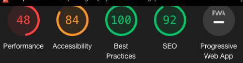
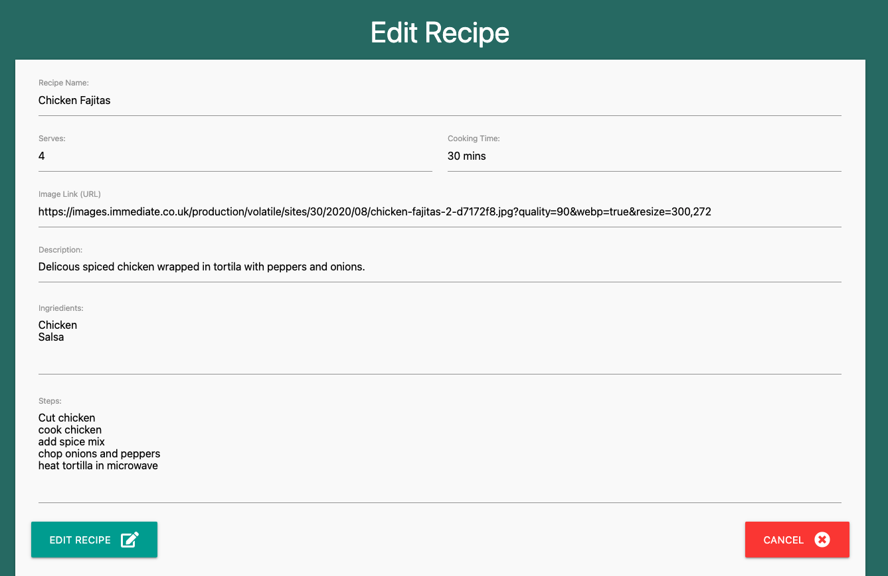
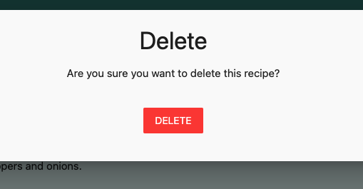

# Testing

[Back to main README.md](README.md)
[View the live project here.](https://flask-recipe-cookbook.herokuapp.com/)

**W3C HTML Validator Results**

There were a couple of issues when tested using the markup validator. 
The error was that I was missing a few images alt attribute, once I have added them, there was no error.

There is one warning, the section lacks heading. However in my code there is an `<h2>` in the code.

**W3C CSS Validator Results**

There was issues with the site however the problem was linked to Materialize CSS, therefore I could not solve these issues.

**PEP8 Online**

**Lighthouse**

Have tested the website using the Lighthouse via Google Developer Tools for it accessibility, SEO and best practice.

On Desktop:

On Mobile:

On it first report, there was some issues with the image alt attribute as it was missing.

After I added the missing img alt attribute, the result slighty improved.

## Testing User Stories

**First Time Visitor Goals**

* As a first-time user, want to understand what the website is about 

    

    However, I felt it needs to be improved. A more detail introduction to the site would benefit new users.

* As a first-time user can clearly see how it works

    

* As a first-time user, want to see the recipes on offer

    This section did not pass, as the recipes are locked as first time users must register to see the recipes avialable.
    This would be be off puting to new visitors.

* As a first-time user, want to visit the web application social media pages

    

* As a first-time user clearly can see where they can register for an account

    

**Returning Visitor Goals**

* As a returning user, able to add new recipes to the community

    

* As a returning user, able to edit their own recipes

    

* As a returning user, able to delete their own recipes

    

* As a returning user, able to see recipes created by others in the community

    

* As a returning user can identify where and easily log in

    

* As a returning user, once logged in can easily navigate through the site

    

**Site Owner Goals**

* As a site owner, able to add and promote their own recipes

    As a admin user, they are able to create their own recipes.
    They can also promote their recipes as any recipes created by admin can only be edit or deleted by the admin user.

* As a site owner, able to keep website content clean

    As a admin user, they have full control over recipes collection as they are allowed to edit or delete any recipes even if they did not created the recipe.

* As a site owner, able to delete any recipes

    As a admin user, they can delete any recipes as they have full control of the site.

* As a site owner, able to edit recipes to fix any mistakes

    As a admin user, they can edit any recipes as they have full control of the site.

**Manual Testing**

1. Logged in as 'Luke1234'.
    * Can clearly see my own profile page.
    * Click on 'recipes' in the navbar and it redirect me to a new page.
    * See a collection of recipes.
    * Clicked on 'Chicken Fajitas' recipe created by the user 'Luke1234', redirects me to a new page.
    * Can see the recipe in full detail with 'edit', 'delete' and 'back' button.
    * Clicked on 'edit' button, it redirect me to the edit form page as it was created by 'Luke1234'
    * On edit recipe page, I can see the data for each section. 
    * Edit to add a new ingredients 'sour cream' and click 'Edit Recipe'
    * Recieved a successful flash message and then clicked on 'cancel' button, redirect me to the collection of recipes.
    * Clicked on 'Fish and Chips' created by user 'lisa1234'
    * Clicked on 'edit', a flash message appears "sorry, you are not allowed to do this"
    * Re-clicked on 'Fish and Chips' recipe, click on 'delete' button, flash message appears ""sorry, you are not allowed to do this"
    * Clicked on add recipe and added 'quick vegetable pasta' into the form, clicked on 'submit'
    * Flash message appears, successfully added recipe.
    * Using search bar, typed in 'pasta', the new recipe pasta successfully appears 
    * Click on recipe to see in full detail
    * All information supplied is now shown in recipe
    * Click on 'Log Out', flash message appears "You have been logged out"

2. Logged in as 'admin'
    * Can clearly see my own profile page.
    * Click on 'recipes' in the navbar and it redirect me to a new page.
    * See a collection of recipes.
    * Clicked on 'Chicken Fajitas' recipe created by the user 'Luke1234', redirects me to a new page.
    * Can see the recipe in full detail with 'edit', 'delete' and 'back' button.
    * Clicked on 'edit' button, it redirect me to the edit form page as it was created by 'Luke1234' but as a admin user can access any recipe
    * On edit recipe page, I can see the data for each section. 
    * Edit to add a new ingredients 'cheese' and click 'Edit Recipe'
    * Recieved a successful flash message and then clicked on 'cancel' button, redirect me to the collection of recipes.
    * Clicked on 'Fish and Chips' created by user 'lisa1234'
    * Click on 'delete' button, flash message appears ""successfully delete recipe"
    * Clicked on add recipe and added '3-veg mac 'n' cheese' into the form, clicked on 'submit'
    * Flash message appears, successfully added recipe.
    * Using search bar, typed in 'cheese', the new recipe pasta successfully appears 
    * Click on recipe to see in full detail
    * All information supplied is now shown in recipe
    * Click on 'Log Out', flash message appears "You have been logged out"
